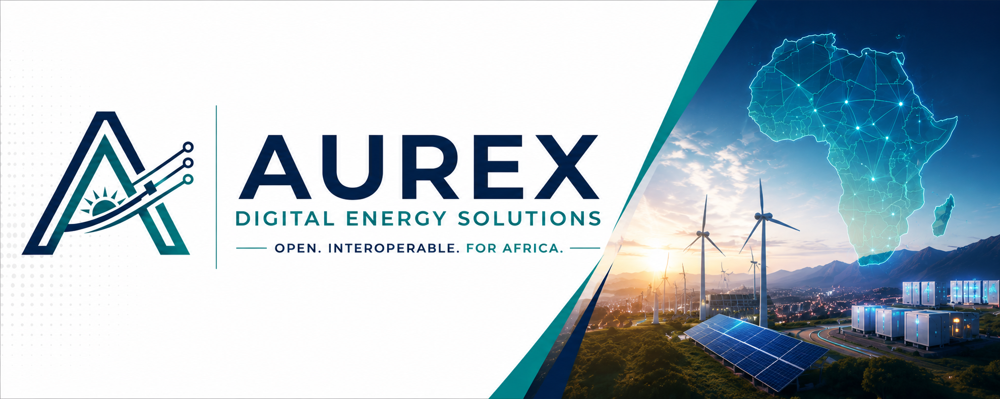

## Open digital infrastructure for Africa's energy transition

Aurex Digital Solutions is a Kenya-origin institution advancing reliable, interoperable, and public-interest digital energy systems across Africa.

## Our Mandate

We research, develop, validate, and steward open, secure digital coordination infrastructure for energy systems. Our work begins with Kenya as a disciplined learning environment and is designed to support African contexts where evidence, partnerships, and authorization justify it.

## What We Build Toward

- **Interoperable systems** that connect energy data, assets, and institutions without locking them into closed ecosystems.
- **Practical energy intelligence** for facilities, distributed resources, and grid-edge coordination.
- **Open technical foundations** including software, data models, reference architectures, and standards.
- **Institutional capacity** through research, measured validation, and responsible collaboration.

## How We Work

| Principle | Commitment |
| --- | --- |
| Public interest | Technology should strengthen accountability, resilience, and equitable access. |
| Open by default | We prefer open standards, interfaces, and reusable components where responsible. |
| Security by design | Critical energy systems require rigorous engineering, privacy, and human oversight. |
| Evidence before scale | Research, prototypes, and controlled validation precede wider claims or deployment. |

## Current Focus

Aurex is in institutional development. Our immediate work is validating facility-level energy coordination needs and developing the research and prototype foundations for a Facility Energy Management System.

Aurex is not a utility, regulator, system operator, government agency, or deployed national energy platform. Any future work involving operational infrastructure will require appropriate evidence, governance, partnerships, and legal authority.

## Explore Aurex

- [Institutional documentation](https://github.com/AUREX-DIGITAL-SOLUTIONS/governance)
- [Governance framework](https://github.com/AUREX-DIGITAL-SOLUTIONS/governance/blob/main/GOVERNANCE-FRAMEWORK.md)
- [Security and responsible technology policy](https://github.com/AUREX-DIGITAL-SOLUTIONS/governance/blob/main/SECURITY-AND-RESPONSIBLE-TECHNOLOGY-POLICY.md)
- [Open-source and licensing framework](https://github.com/AUREX-DIGITAL-SOLUTIONS/governance/blob/main/OPEN-SOURCE-AND-LICENSING-FRAMEWORK.md)

**Open. Interoperable. For Africa.**
